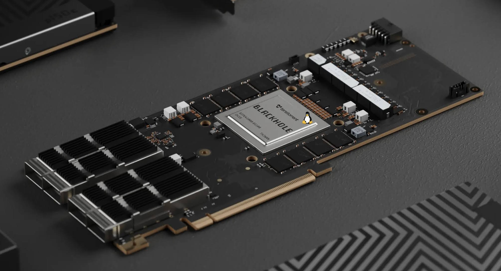
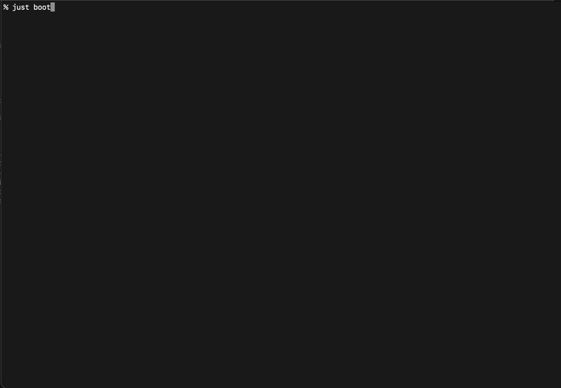

# Tenstorrent Blackhole P100/P150 Linux demo

This is a demo of Linux running on the [Tenstorrent Blackhole
P100/P150](https://tenstorrent.com/hardware/blackhole) PCIe card using the
onboard [SiFive X280](https://www.sifive.com/cores/intelligence-x200-series)
RISC-V cores.



(*Note: This is **not** a Tenstorrent designed CPU such as the high performance
[Ascalon](https://tenstorrent.com/en/ip/tt-ascalon) core*)

This demo downloads OpenSBI, Linux and userspace images, configures them on the
Blackhole hardware and starts the X280 cores to boot them.

## Recipe for the Impatient

#### Quick-start to boot Linux to a console

The tooling assumes an Ubuntu or Debian-based Linux host.

```
sudo apt install make git
git clone https://github.com/tenstorrent/tt-bh-linux
cd tt-bh-linux
make install_all
make install_tt_installer
make download_all
make boot
```
Log in with user: `debian`, password: _[no password]_. Quit with `Ctrl-A x`.

The host tool uses slirp to provide userspace networking. Port 2222 is
forwarded to port 22 on the RISC-V. Log in using:
```
make ssh
```

**This demo *cannot* be used concurrently with the [Tenstorrent AI stack](https://github.com/tenstorrent/tt-metal).**

## Blackhole Hardware
* Blackhole is a heterogeneous grid of cores linked by a Network on Chip (NOC)
* Core types include Tensix, Ethernet, PCIe, DDR, L2CPU, and more
* Contains 120 Tensix cores (used for ML workloads; not Linux-capable)
* Contains 4x L2CPU blocks
* Each L2CPU contains 4x X280 cores (i.e. 16 cores total; Linux-capable)
* Each L2CPU can run as a single coherent SMP
* Separate L2CPUs aren't coherent
* Memory/registers in a core are accessed through mappable windows in PCIe BARs
  * Software refers to these windows as TLBs
  * Blackhole has 2MB (in BAR0) and 4GB (in BAR4) varieties
  * Allows software running on the host to access arbitrary locations on the NOC
* A similar mappable window mechanism exists in each L2CPU address space
  * Also referred to as TLBs or NOC TLBs
  * 2MB and 128GB varieties
  * Allows software running on X280 to access arbitrary locations on the NOC
* The first two L2CPU blocks each have 4GB of DRAM attached; the second two
L2CPU blocks share 4GB of DRAM (see diagram)
```
┌───────────────────────────────────────────────────────────────────────┐
│                                                                       │
│                                                            BLACKHOLE  │
│                                                                       │
│    ┌────────┐ ┌────────┐ ┌────────┐ ┌────────┐┌────────┐ ┌────────┐   │
│    │ TENSIX │ │ TENSIX │ │ TENSIX │ │ TENSIX ││ TENSIX │ │ TENSIX │   │
│    └────────┘ └────────┘ └────────┘ └────────┘└────────┘ └────────┘   │
│      ............................................................     │
│    ┌────────┐ ┌────────┐ ┌────────┐ ┌────────┐┌────────┐ ┌────────┐   │
│    │ TENSIX │ │ TENSIX │ │ TENSIX │ │ TENSIX ││ TENSIX │ │ TENSIX │   │
│    └────────┘ └────────┘ └────────┘ └────────┘└────────┘ └────────┘   │
│    ┌────────┐ ┌────────┐ ┌────────┐ ┌────────┐┌────────┐ ┌────────┐   │
│    │ TENSIX │ │ TENSIX │ │ TENSIX │ │ TENSIX ││ TENSIX │ │ TENSIX │   │
│    └────────┘ └────────┘ └────────┘ └────────┘└────────┘ └────────┘   │
│   ┌─────────────┐  ┌─────────────┐  ┌─────────────┐  ┌─────────────┐  │
│   │ ┌──────┐    │  │ ┌──────┐    │  │ ┌──────┐    │  │ ┌──────┐    │  │
│   │ │┌─────┴┐   │  │ │┌─────┴┐   │  │ │┌─────┴┐   │  │ │┌─────┴┐   │  │
│   │ ││┌─────┴┐  │  │ ││┌─────┴┐  │  │ ││┌─────┴┐  │  │ ││┌─────┴┐  │  │
│   │ │││┌─────┴┐ │  │ │││┌─────┴┐ │  │ │││┌─────┴┐ │  │ │││┌─────┴┐ │  │
│   │ └┤││      │ │  │ └┤││      │ │  │ └┤││      │ │  │ └┤││      │ │  │
│   │  └┤│ X280 │ │  │  └┤│ X280 │ │  │  └┤│ X280 │ │  │  └┤│ X280 │ │  │
│   │   └┤      │ │  │   └┤      │ │  │   └┤      │ │  │   └┤      │ │  │
│   │    └──────┘ │  │    └──────┘ │  │    └──────┘ │  │    └──────┘ │  │
│   │       L2CPU │  │       L2CPU │  │       L2CPU │  │       L2CPU │  │
│   └──────┬──────┘  └──────┬──────┘  └──────┬──────┘  └──────┬──────┘  │
│          │                │                └────────┬───────┘         │
└──────────┼────────────────┼─────────────────────────┼─────────────────┘
       ┌───┴───┐        ┌───┴───┐                 ┌───┴───┐
       │       │        │       │                 │       │
       │  4GB  │        │  4GB  │                 │  4GB  │
       │ DRAM  │        │ DRAM  │                 │ DRAM  │
       │       │        │       │                 │       │
       └───────┘        └───────┘                 └───────┘
```
*(Note: This is a simplified diagram. Using memory remapping (via NoC TLBs) all
all L2CPUs can access all DRAMs. Doing this is much slower and potentially
non-coherent)*

Blackhole also has 120 Tensix cores (not Linux capable). P100 has an additional
16GB of attached DRAM and P150 has an additional 20GB of attached DRAM (ie.
28/32GB for total for P100/P150 respectfully). These additional resources aren't
use for this demo.

## Dependencies

The demo uses the same interfaces as the Tenstorrent System Management
Interface (TT-SMI) tool to interact with the Blackhole PCIe device:

 * [luwen](https://github.com/tenstorrent/luwen/), a Rust library with a Python
   interface for programming Tenstorrent hardware
 * [tt-kmd](https://github.com/tenstorrent/tt-kmd/), a Linux kernel module that
   provides an interface for userspace such as luwen

The recommended way to install these dependencies is with
[tt-installer](https://github.com/tenstorrent/tt-installer/).

### Manual installation

If you prefer to manually install tt-smi, first install the dependencies:
```
sudo apt install -y python3-venv cargo rustc
```

Then install tt-smi using pipx:
```
pipx install https://github.com/tenstorrent/tt-smi
```
luwen is installed as a dependency of tt-smi.

The kernel module can be installed by following the instructions on the
[tt-kmd](https://github.com/tenstorrent/tt-kmd/) repository.

## Theory of Operation
This information is provided as a reference. It is suggested to use `make` to
perform setup and boot steps. Please refer to the Makefile for details on
specific dependencies.

[More information is available here](INFO.md)

### Initial Setup
This is automated by `make build_all` and `make install_tt_installer`.
* Install packages from your Linux distribution:
  * Packages for cross-compiling Linux/OpenSBI for RISC-V
  * Packages for establishing a Python virtual environment for `pyluwen`
  * Build dependencies for the `tt-bh-linux` tool
* Install the tt-kmd kernel driver
* Create a Python virtual environment:
  * Install tt-smi
  * Install pyluwen
* Build a Linux kernel image from
[tt-blackhole branch](https://github.com/tenstorrent/linux/tree/tt-blackhole)
* Build an OpenSBI image from
[tt-blackhole branch](https://github.com/tenstorrent/opensbi/tree/tt-blackhole)
* Build `tt-bh-linux` tool

### Boot Flow
This is automated by `make boot`.
* Enter the Python virtual environment which contains pyluwen
* Invoke boot.py, which:
  * resets the entire Blackhole chip
  * copies binary data to X280's DRAM (OpenSBI, Linux, rootfs, device tree)
  * programs X280 reset vector and resets the L2CPU tile, causing X280 to start
  executing OpenSBI
  * configures X280 L2 prefetcher with parameters recommended by SiFive
* Invoke tt-bh-linux program (establishes console and network access)

## FAQ

### How does the console work?
* OpenSBI implements a virtual UART consisting of two circular buffers and a
magic signature
* One circular buffer is for transmitting characters; the other is for receiving
* A pointer to this virtual UART exists in a known location
* `bootargs` in the device tree causes Linux to use the hvc driver, which
interfaces with OpenSBI to provide a console to Linux
* Host software (`tt-bh-linux`) maps a 2MB window to the location of OpenSBI in
the X280's memory and scans it to find the pointer to the virtual UART
* `tt-bh-linux` maps a new 2MB window at the location of the virtual UART (which
was discovered in the previous step)
* `tt-bh-linux` and OpenSBI interact with the two circular buffers in a classic
producer/consumer fashion, with `tt-bh-linux` accepting character input from the
user and printing character output from OpenSBI/Linux
* The mechanism is completely polling-driven; there are no interrupts

### How does the network work?
* A [kernel driver](https://github.com/tenstorrent/linux/tree/tt-blackhole/drivers/net/ethernet/tenstorrent)
(on the X280 side) owns TX and RX circular buffers and uses them in a manner 
very similar to the console program
* `tt-bh-linux` knows the location of these buffers and uses
[libslirp](https://gitlab.freedesktop.org/slirp/libslirp) to provide a host-side
interface
* Via slirp, the host side provides DHCP to the X280 side
* Unlike the console, the X280 driver receives interrupts initiated by the host
* The host program is polling-based

### What is the X280's address map?
| Base             | Top              | PMA    | Description                 |
|------------------|------------------|--------|-----------------------------|
| 0x0000_0000_0000 | 0x0000_0000_0FFF |        | Debug                       |
| 0x0000_0000_1000 | 0x0000_0000_2FFF |        | Unmapped                    |
| 0x0000_0000_3000 | 0x0000_0000_3FFF | RWX A  | Error Device                |
| 0x0000_0000_4000 | 0x0000_0000_4FFF | RW A   | Test Indicator              |
| 0x0000_0000_5000 | 0x0000_016F_FFFF |        | Unmapped                    |
| 0x0000_0170_0000 | 0x0000_0170_0FFF | RW A   | Hart 0 Bus-Error Unit       |
| 0x0000_0170_1000 | 0x0000_0170_1FFF | RW A   | Hart 1 Bus-Error Unit       |
| 0x0000_0170_2000 | 0x0000_0170_2FFF | RW A   | Hart 2 Bus-Error Unit       |
| 0x0000_0170_3000 | 0x0000_0170_3FFF | RW A   | Hart 3 Bus-Error Unit       |
| 0x0000_0170_4000 | 0x0000_01FF_FFFF |        | Unmapped                    |
| 0x0000_0200_0000 | 0x0000_0200_FFFF | RW A   | CLINT                       |
| 0x0000_0201_0000 | 0x0000_0201_3FFF | RW A   | L3 Cache Controller         |
| 0x0000_0201_4000 | 0x0000_0202_FFFF |        | Unmapped                    |
| 0x0000_0203_0000 | 0x0000_0203_1FFF | RW A   | Hart 0 L2 Prefetcher        |
| 0x0000_0203_2000 | 0x0000_0203_3FFF | RW A   | Hart 1 L2 Prefetcher        |
| 0x0000_0203_4000 | 0x0000_0203_5FFF | RW A   | Hart 2 L2 Prefetcher        |
| 0x0000_0203_6000 | 0x0000_0203_7FFF | RW A   | Hart 3 L2 Prefetcher        |
| 0x0000_0203_8000 | 0x0000_0300_7FFF |        | Unmapped                    |
| 0x0000_0300_8000 | 0x0000_0300_8FFF | RW A   | SLPC                        |
| 0x0000_0300_9000 | 0x0000_07FF_FFFF |        | Unmapped                    |
| 0x0000_0800_0000 | 0x0000_081F_FFFF | RWX A  | L3 LIM                      |
| 0x0000_0820_0000 | 0x0000_09FF_FFFF |        | Unmapped                    |
| 0x0000_0A00_0000 | 0x0000_0A1F_FFFF | RWXIDA | L3 Zero Device              |
| 0x0000_0A20_0000 | 0x0000_0BFF_FFFF |        | Unmapped                    |
| 0x0000_0C00_0000 | 0x0000_0FFF_FFFF | RW A   | PLIC                        |
| 0x0000_1000_0000 | 0x0000_1000_0FFF | RW A   | Trace Encoder 0             |
| 0x0000_1000_1000 | 0x0000_1000_1FFF | RW A   | Trace Encoder 1             |
| 0x0000_1000_2000 | 0x0000_1000_2FFF | RW A   | Trace Encoder 2             |
| 0x0000_1000_3000 | 0x0000_1000_3FFF | RW A   | Trace Encoder 3             |
| 0x0000_1000_4000 | 0x0000_1001_7FFF |        | Unmapped                    |
| 0x0000_1001_8000 | 0x0000_1001_8FFF | RW A   | Trace Funnel                |
| 0x0000_1001_9000 | 0x0000_1010_3FFF |        | Unmapped                    |
| 0x0000_1010_4000 | 0x0000_1010_7FFF | RW A   | Hart 0 Private L2 Cache     |
| 0x0000_1010_8000 | 0x0000_1010_BFFF | RW A   | Hart 1 Private L2 Cache     |
| 0x0000_1010_C000 | 0x0000_1010_FFFF | RW A   | Hart 2 Private L2 Cache     |
| 0x0000_1011_0000 | 0x0000_1011_3FFF | RW A   | Hart 3 Private L2 Cache     |
| 0x0000_1011_4000 | 0x0000_1FFF_FFFF |        | Unmapped                    |
| 0x0000_2000_0000 | 0x0000_2FFF_FFFF | RWXI A | Peripheral Port (256 MiB)   |
| 0x0000_3000_0000 | 0x4000_2FFF_FFFF | RWXI   | System Port (64 TiB)        |
| 0x4000_3000_0000 | 0x7FFF_FFFF_FFFF | RWXIDA | Memory Port (64.0 TiB)      |
| 0x8000_0000_0000 | 0xFFFF_FFFF_FFFF |        | Unmapped                    |

Physical Memory Attributes:
* **R**–Read
* **W**–Write
* **X**–Execute
* **I**–Instruction Cacheable
* **D**–Data Cacheable
* **A**–Atomics

### System, Memory, Peripheral Ports?
System Port and Memory Port differ only by PMA. The bottom 4 GB of these regions
is mapped to the 4 GB of memory controlled by the adjacent DRAM controller. Note
that L2CPU instances 2 and 3 share the same 4 GB of DRAM.

From the perspective of the NOC, accesses targeting the memory port are coherent
with the X280's cache subsystem.

The peripheral port contains registers for e.g. DMA controller and NOC TLBs.
These may be documented in a future release.

### What is Luwen? pyluwen?
[Luwen]([luwen](https://github.com/tenstorrent/luwen/)) is a library written in
Rust that provides an interface for accessing Tenstorrent accelerator devices.
Luwen provides Python bindings (`pyluwen`), used by boot.py.

### Can the X280 access other cores, e.g. a Tensix or memory on the Linux host?
Yes, see [here](docs/addressing.md)

### Why is `tt-bh-linux`'s console output corrupted?
You probably have multiple instances of it running against one L2CPU.

### What is harvesting?
For silicon yield purposes, cores within the grid may be disabled. Software
refers to disabled cores as _harvested_.
* p100a: 1 DRAM controller is harvested (for 28GB of total DRAM); 20x Tensix
cores are harvested (for a total of 120)
* p150a/b harvesting: DRAM and Tensix are not harvested (32GB total DRAM; 140x
Tensix cores)

### How does DRAM harvesting affect L2CPU usage?
If your p100a has an L2CPU0 block with a harvested DRAM controller, booting will
fail. Use an alternate L2CPU instance with e.g. `--l2cpu 1`.

Associating an L2CPU block with alternate DRAM is possible via NOC TLB mappings,
although the latency is higher. Configuring this requires device tree and boot
script modifications.

### How do I access an X280's address space from the Linux host?
The console and network programs have examples of how to do this. The steps are:
* Configure an inbound TLB window using the (x, y) location of the target and
desired address; mmap the window into your application's address space
* The address must be aligned to the window size (2MB or 4GB)
* On an x86_64 host, you can mmap the window as write combining (WC) or
uncacheable (UC)
* Reads and writes to the window result in NOC access to the target

### What are the NOC0 coordinates of the L2CPU blocks?
* L2CPU0: (8, 3)
* L2CPU1: (8, 9)
* L2CPU2: (8, 5)
* L2CPU3: (8, 7)

### NOC0?
There are two independent NOCs: NOC0 and NOC1. Only NOC0 is used in this demo.
NOC1 coordinates of the L2CPU blocks are as follows.
* L2CPU0: (8, 8)
* L2CPU1: (8, 2)
* L2CPU2: (8, 6)
* L2CPU3: (8, 4)

### How do I recover a hung or misbehaving chip?
Use `tt-smi` to perform a reset: `tt-smi -r 0` resets device 0. If this is 
unsuccessful, a power cycle is recommended.

### Help! The boot script hangs at `Writing rootfs to ...`
This is a known issue on some systems. Give it a few minutes. This will be
fixed in a future release.
